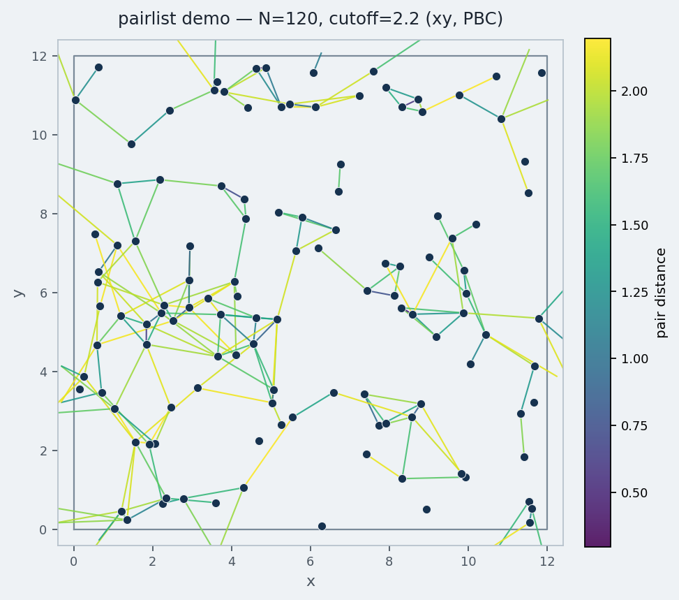

# {{tool.poetry.name}}

Fast neighbor (pair) lists for particles under periodic boundary conditions.

Given coordinates and a cutoff, it yields index pairs \((i, j)\) whose distance
is below the threshold. Internally it uses a cell-list algorithm with an
optional C extension.

version {{tool.poetry.version}}

## Install

```shell
pip install pairlist
```

## Quick start

No external data files are required—only NumPy.

```python
import numpy as np
import pairlist as pl

N = 500
cell = np.eye(3) * 20.0                         # 20 × 20 × 20 box
pos = np.random.default_rng(0).random((N, 3))    # fractional coordinates

for i, j, r in pl.pairs_iter(pos, maxdist=3.0, cell=cell):
    # i, j: particle indices; r: distance in the same unit as cell
    print(i, j, r)
```

Absolute coordinates work the same way if you set `fractional=False`:

```python
pos_abs = pos @ cell
for i, j, r in pl.pairs_iter(
    pos_abs, maxdist=3.0, cell=cell, fractional=False
):
    ...
```

Pairs between two sets of points:

```python
pos_A = np.random.default_rng(1).random((100, 3))
pos_B = np.random.default_rng(2).random((200, 3))
for i, j, r in pl.pairs_iter(pos_A, maxdist=3.0, cell=cell, pos2=pos_B):
    ...
```

API reference: [pairlist.html](https://vitroid.github.io/PairList/pairlist.html)

## Demo: draw neighbor bonds



Particles in a periodic box; lines are pairs within the cutoff
(colored by distance; minimum-image segments). Regenerate with:

```shell
python samples/demo_bonds.py -o benchmark/demo.png
```

Minimal version:

```python
import numpy as np
import matplotlib.pyplot as plt
import pairlist as pl

rng = np.random.default_rng(0)
cell = np.eye(3) * 10.0
pos = rng.random((80, 3))
xyz = pos @ cell

fig, ax = plt.subplots(figsize=(5, 5))
ax.scatter(xyz[:, 0], xyz[:, 1], s=12, zorder=2)
for i, j, _ in pl.pairs_iter(pos, maxdist=2.0, cell=cell):
    ax.plot(
        [xyz[i, 0], xyz[j, 0]],
        [xyz[i, 1], xyz[j, 1]],
        color="0.6",
        lw=0.6,
        zorder=1,
    )
ax.set_aspect("equal")
ax.set_title("pairs within cutoff (xy projection)")
plt.show()
```

## Benchmark

Cell lists vs. naive \(O(N^2)\) and other methods:

[benchmark.ipynb](https://colab.research.google.com/github/vitroid/PairList/blob/master/benchmark.ipynb)
<a href="https://colab.research.google.com/github/vitroid/PairList/blob/master/benchmark.ipynb" target="_parent"></a>


## C / other languages

The core cell-list routines are also available as a small C library
(`csource/pairlist.h`, `libpairlist.a`). See the header for the API.

## Optional: GenIce samples

The scripts under `samples/` (RDF, hydrogen-bond graph, …) read Gromacs-style
coordinates. You can generate an example box with
[GenIce](https://github.com/vitroid/GenIce):

```shell
genice2 CRN1 -r 2 2 2 > CRN1x222.gro
python samples/RDF_pairlist.py < CRN1x222.gro
```

Or simply `make test` if GenIce is installed.

## Requirements

* {{item}}

